# python-tic-tac-toe

Let's play Tic-Tac-Toe, shall we?

1- Clone this repository.

2- Download PostgreSQL and install it on your system.

3- Run the command pip install psycopg2.

4- Issue the command pip install python-dotenv

5- At the root of the project create the text file called .env and there put the environment variables similar to the .env.example file.

6- Execute the command python app.py

7- Start playing the Tic-Tac-Toe game. Be ready to use the keyboard.

Happy Tic-Tac-Toe! :-)

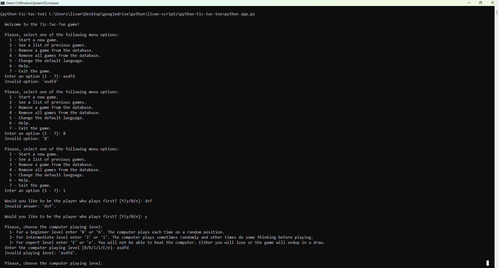

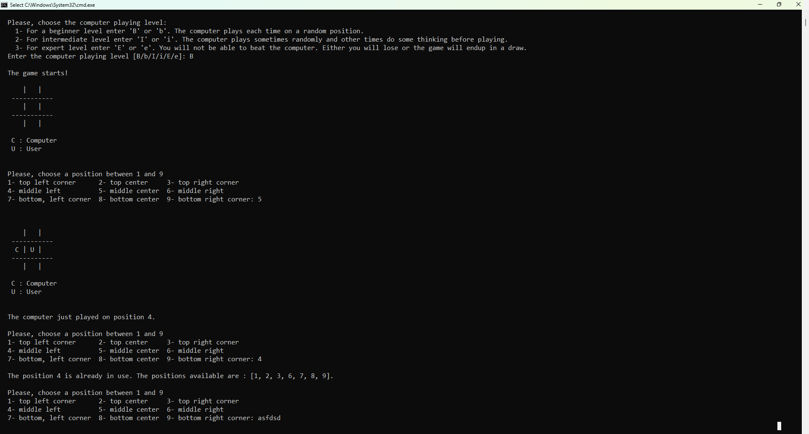

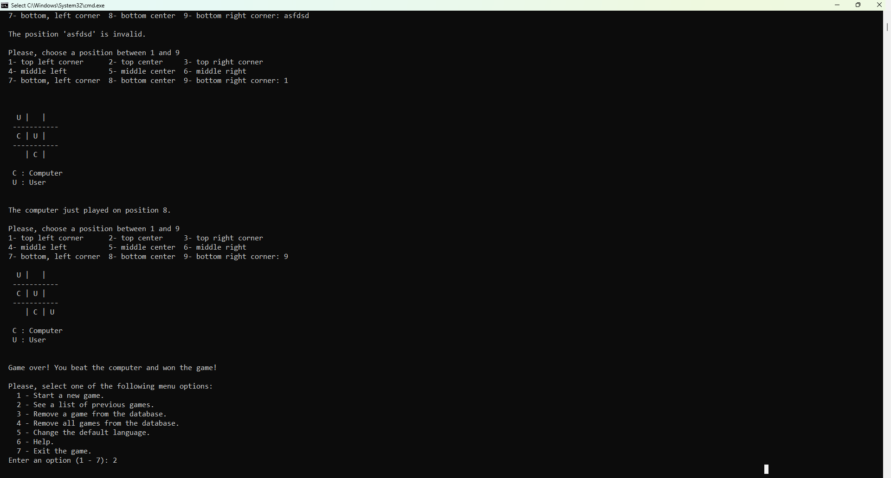

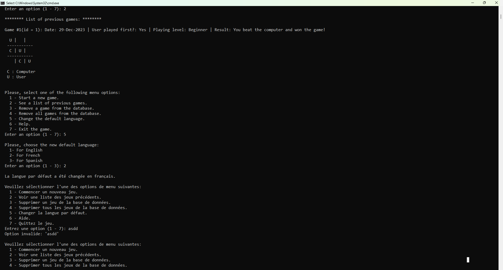

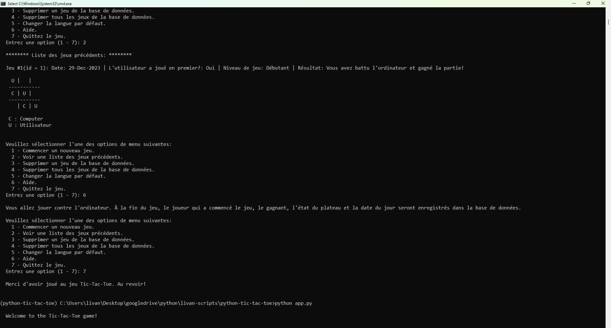

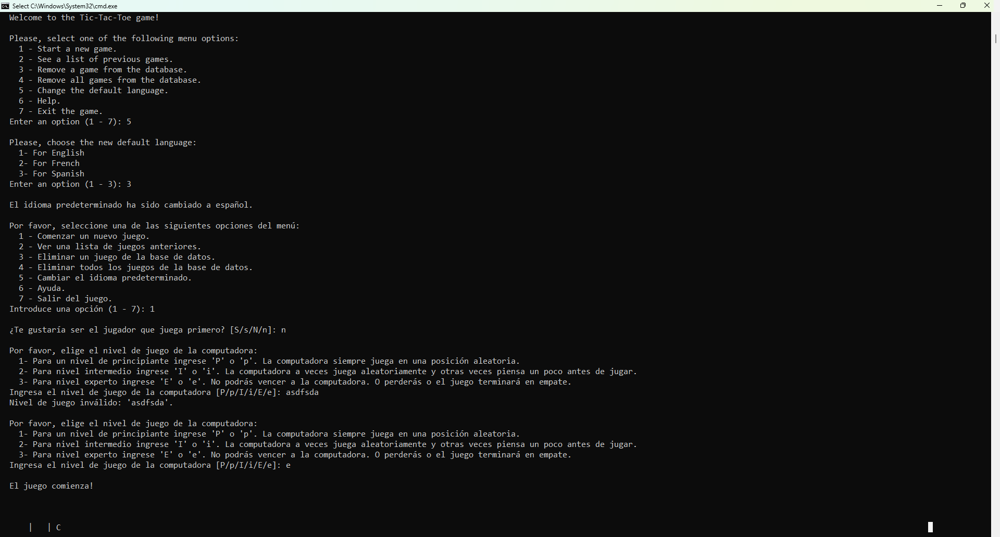

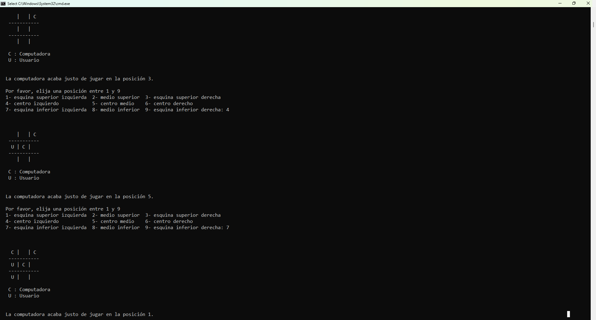

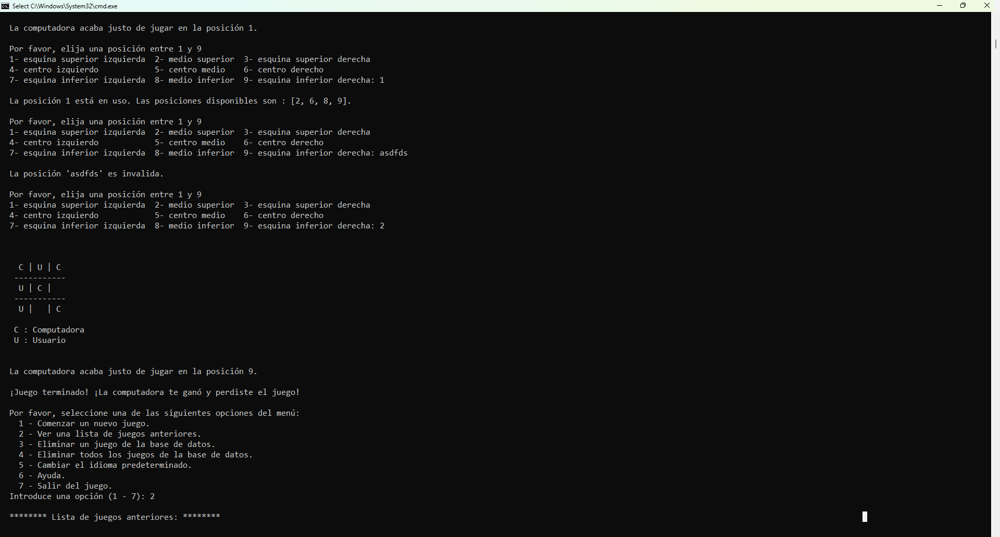

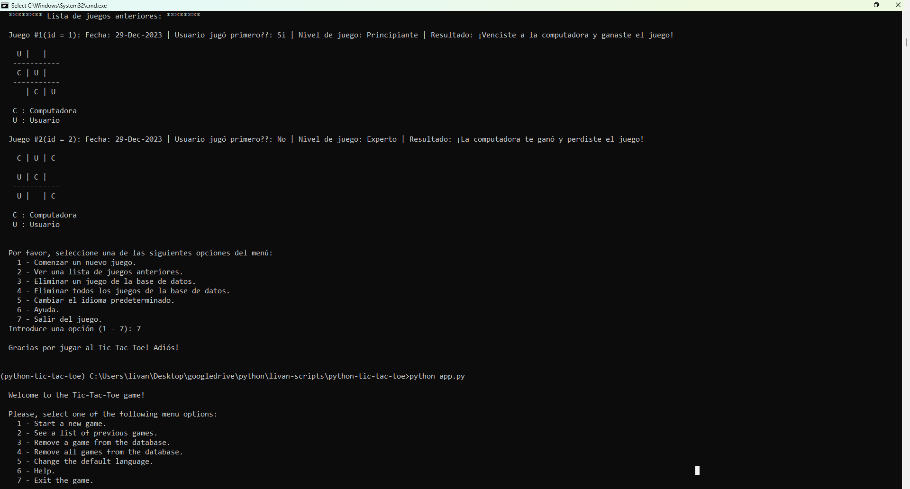

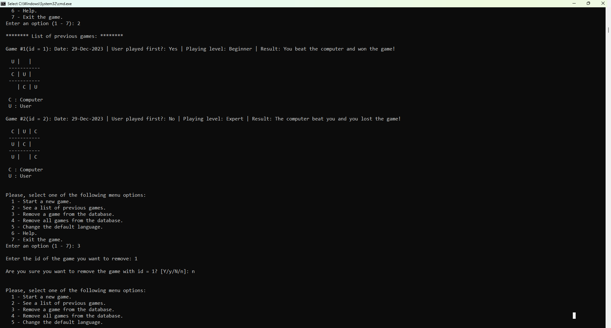

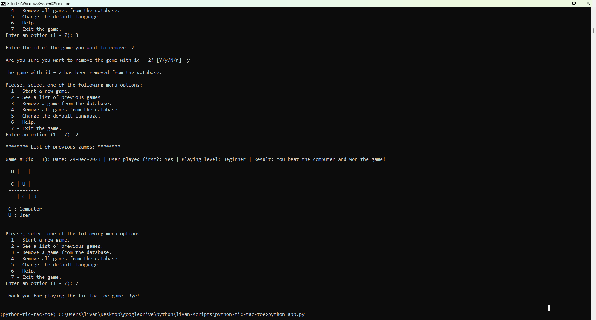

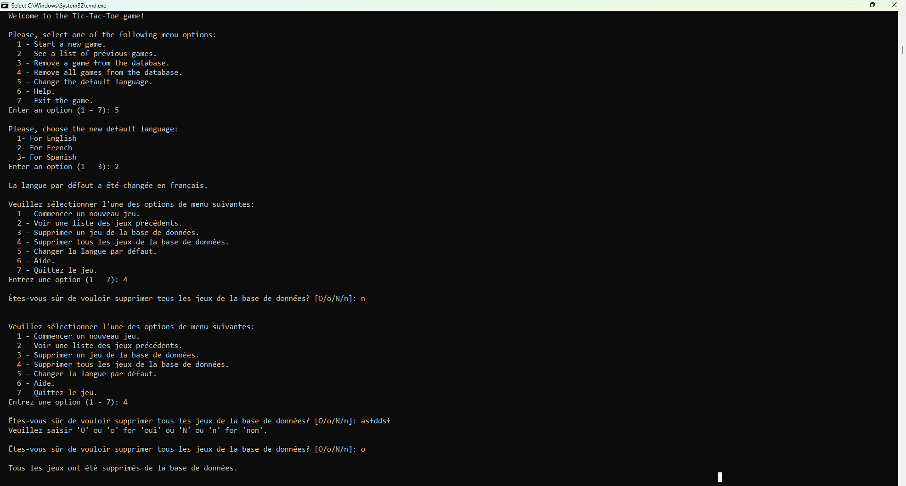

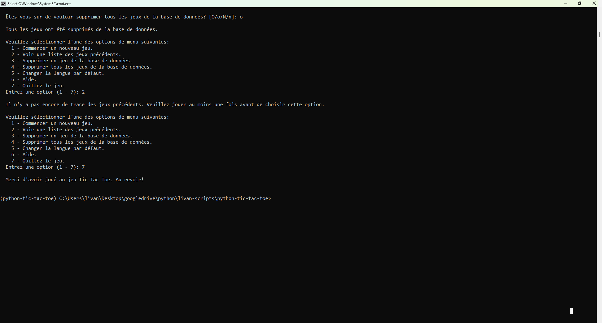
